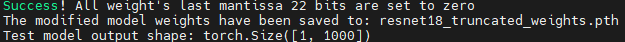
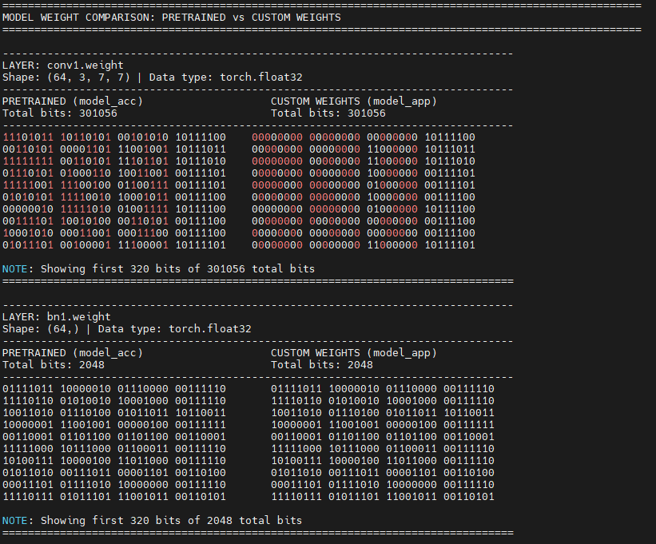
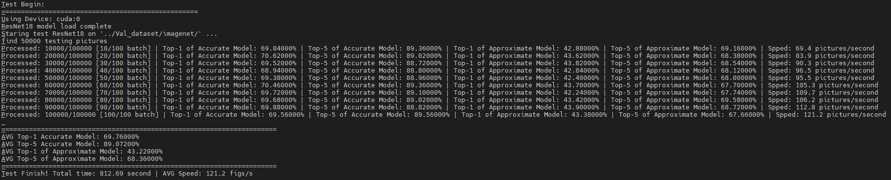
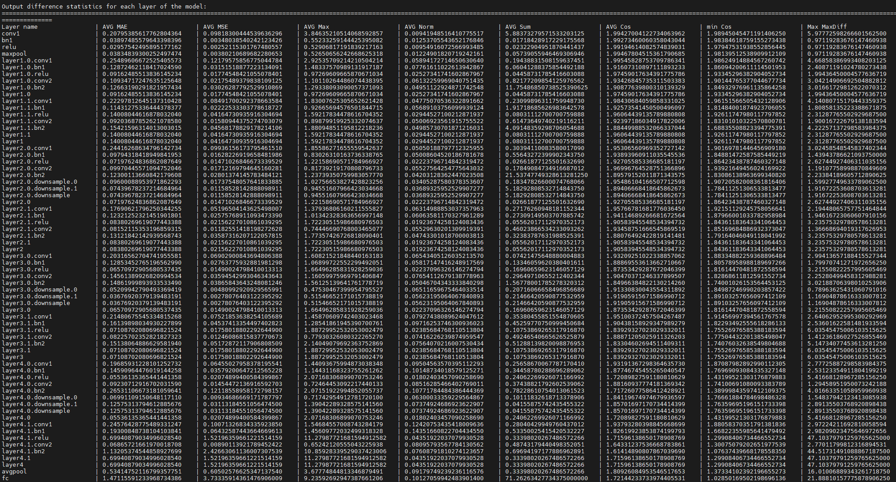

## The following files are included in the profiling directory:

1. resnet18_model_mantissa.py
    Implements mantissa masking operations on model weights for ResNet18.

2. test_mantissa.py
    Validates the effectiveness of mantissa masking after application.

3. resnet18_weight_mantissa_test.py
    Compares Top-1 and Top-5 accuracy between original FP32 weights and mantissa-masked weights.

4. resnet18_layer_diff_test.py
    Performs layer-wise output statistics and comparisons between original FP32 weights and mantissa-masked weights.

5. weight_distribute.py (with results in weight-distribution.txt)
    Analyzes and visualizes the distribution of weights across different model parameters.

The ResNet architecture in the file can be substituted with any model supported by the PyTorch framework.

## Environment Requirements

    PyTorch
    CUDA

## Execution Steps

1. Modify and Run resnet18_model_mantissa.py:
    Adjust the parameter to specify the number of mantissa bits to truncate:
    ```
        bits = 22
    ```
    Configure the output path for the modified weights:
    ```
        torch.save(modified_model.state_dict(), "./weight/resnet18_truncated_weights.pth")
    ```
    Execute the script to generate masked model weights:
    ```
        python3 resnet18_model_mantissa.py
    ```
    

1. Validate Masking with test_mantissa.py:
    Run this script to verify the correctness of the mantissa masking process:
    ```
        python3 test_mantissa.py
    ```
    Expected output: Validation metrics confirming successful masking:
    

2. Evaluate Accuracy with resnet18_weight_mantissa_test.py:
    Update the paths to test images, labels, and the modified weights:
    ```
        model_app.load_state_dict(torch.load('./weight/resnet18_truncated_weights.pth'))

        image_dir = "../Val_dataset/imagenet/"
        label_file = "../Val_dataset/imagenet/label.txt"
    ```
    Execute to obtain Top-1/Top-5 accuracy comparisons between original and masked models:
    


3. Analyze Layer-wise Differences with resnet18_layer_diff_test.py:
    Configure paths to test data and modified weights.
    Run to generate layer-by-layer statistical comparisons between original and masked model outputs:
    